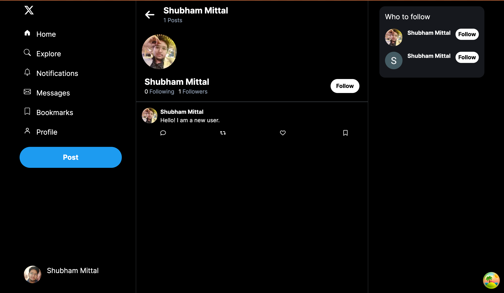

# Twitter clone

Twitter clone developed using NextJs and NodeJs.

## Used Technologies
- **Node.js**: Backend
- **GraphQl**: API
- **Prisma ORM**: Database ORM
- **PostgreSQL**: Database
- **Supabase**: Hosting and managing cloud Postgresql db
- **Redis**: Query caching on the server side
- **Google OAuth**: Sign In with google
- **JSON WEB TOKENS**: Authentication
- **Next.js**: Frontend
- **TailwindCSS**: Styling
- **Codegen**: Typesafe GraphQL queries and mutations
- **Graphql-Request**: API client for client-server communication
- **React-Query**: client-side data caching
- **Typescript**: Write type safe code
- **Amazon Web Services**: For storage
- **Fly.io**: Backend Deployment
- **Vercel**: Frontend deployment

## Features
- Authentication with Json Web tokens.
- Users can create an account.
- Users can add tweets with/without images.
- Users can like/unlike tweets.
- Users can follow others.

## Work in progress
- Comment on tweets.
- Edit profile.
- Sign in without google.

## Screenshots

### Home Page

### Profile Page

### Create new Tweet

### Follow Users

### Like tweets
